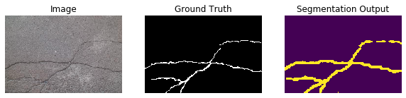

##### **Segmentation of Acute Respiratory Artifacts due to Coronavirus Related Infection with Deep Learning**

##### CS230 : Deep Learning

This code aims to input a data-set composed of COVID-19 CT-Scans and their associated radiologist defined masks. 
The model attempts to learn which artifacts are common between COVID-19 patients, and learns to segment them. 
This work has made extensive use and has been adapted from a wide array of contributers whom, without them, would 
have made this applied Deep Learning study of DeepLabV3 on COVID-19 CT-Scans a very difficult task. This work stands 
on their shoulders. 

Please see the original README documentation presented below from the original author of this code. 

His original write-up may be seen at the following :
* https://expoundai.wordpress.com/2019/08/30/transfer-learning-for-segmentation-using-deeplabv3-in-pytorch/

Additionally, one may view his GitHub repository at the following : 
* https://github.com/msminhas93/DeepLabv3FineTuning


The dataset was largely adapted from the volumetric CT-Scans found at the following : 
* http://medicalsegmentation.com/covid19/

Contributing Author Repositories : 

Common Image Segmentation Losses by Mfmezger : 
 * https://github.com/kevinzakka/pytorch-goodies/blob/master/losses.py 
 
Common Image Segmentation Metrics by Kevinzakka : 
 * https://github.com/kevinzakka/pytorch-goodies/blob/master/metrics.py
 
Pytorch 3dUnet by Wolny : 
 * https://github.com/wolny/pytorch-3dunet
 


 


##### DeepLabv3FineTuning (Original README)

This repository contains code for Fine Tuning [DeepLabV3 ResNet101](https://arxiv.org/abs/1706.05587) in PyTorch. The model is from the [torchvision module](https://pytorch.org/docs/stable/torchvision/models.html#semantic-segmentation). The tutorial can be found here: [https://expoundai.wordpress.com/2019/08/30/transfer-learning-for-segmentation-using-deeplabv3-in-pytorch/](https://expoundai.wordpress.com/2019/08/30/transfer-learning-for-segmentation-using-deeplabv3-in-pytorch/)

I've fine tuned the model for the [CrackForest](https://github.com/cuilimeng/CrackForest-dataset) data-set. 

The model was fine tuned for 25 epochs and achieves an testing AUROC value of 0.837214.

The segmentation output of the model on a sample image are shown below.



To run the code on your dataset use the following command.

```
python main.py "data_directory_path" "experiment_folder_where weights and log file need to be saved"
```
It has following two optional arguments:
```
--epochs : Specify the number of epochs. Default is 25.
--batchsize: Specify the batch size. Default is 4.
```
The datahandler module has two functions for creating datasets fron single and different folders.

1. ```get_dataloader_sep_folder(data_dir, imageFolder='Images', maskFolder='Masks', batch_size=4)```

Create Train and Test dataloaders from two separate Train and Test folders. The directory structure should be as follows.
```
data_dir
--Train
------Image
---------Image1
---------ImageN
------Mask
---------Mask1
---------MaskN
--Train
------Image
---------Image1
---------ImageN
------Mask
---------Mask1
---------MaskN
```
2. ```get_dataloader_single_folder(data_dir, imageFolder='Images', maskFolder='Masks', fraction=0.2, batch_size=4)```

Create from a single folder. The structure should be as follows.
```
--data_dir
------Image
---------Image1
---------ImageN
------Mask
---------Mask1
---------MaskN
```

The repository also contains a JupyterLab file with the loss and metric plots as well as the sample prediction code.
